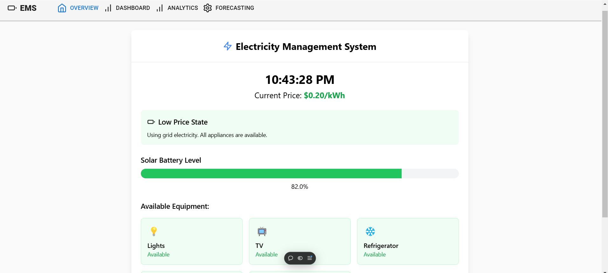

  <!-- Replace with the actual path to your image -->

This project, hosted at [Electricity Management](https://electricity-management.vercel.app/), is a dynamic electricity pricing prediction platform. It leverages machine learning to forecast electricity prices, allowing users to optimize their energy consumption based on real-time data.

## Overview

The platform predicts electricity prices based on factors like time of day, demand, and historical pricing patterns. By providing real-time predictions, it assists users in minimizing energy costs by adjusting their usage according to lower tariff periods.

## Features

- **Dynamic Pricing Predictions**: Machine learning models analyze and forecast pricing fluctuations.
- **Time-of-Use Optimization**: Recommendations for shifting energy consumption to cost-effective periods.
- **User-Friendly Interface**: Intuitive design to make pricing predictions easily accessible.
